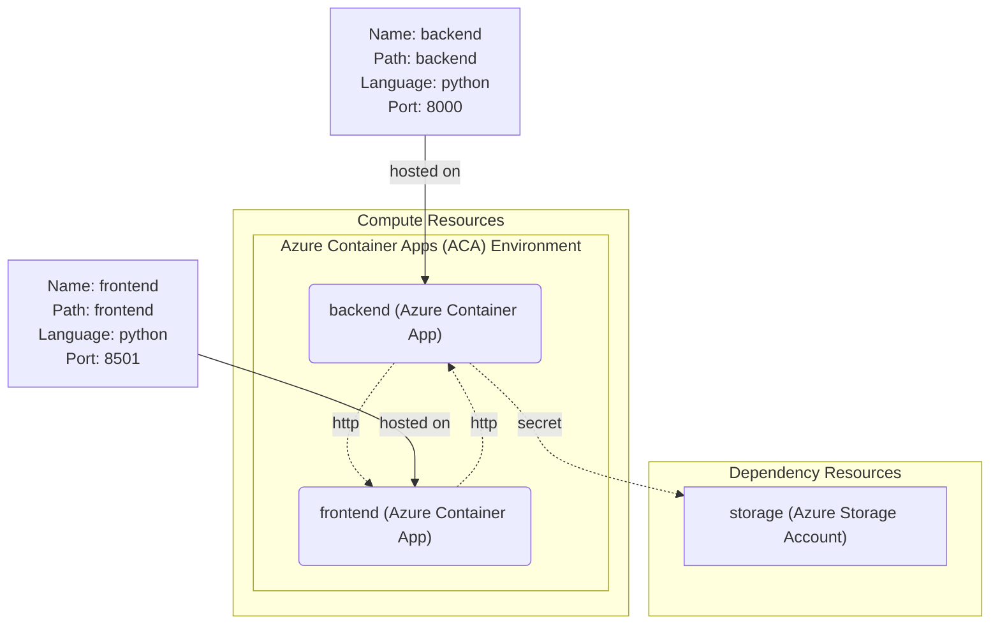
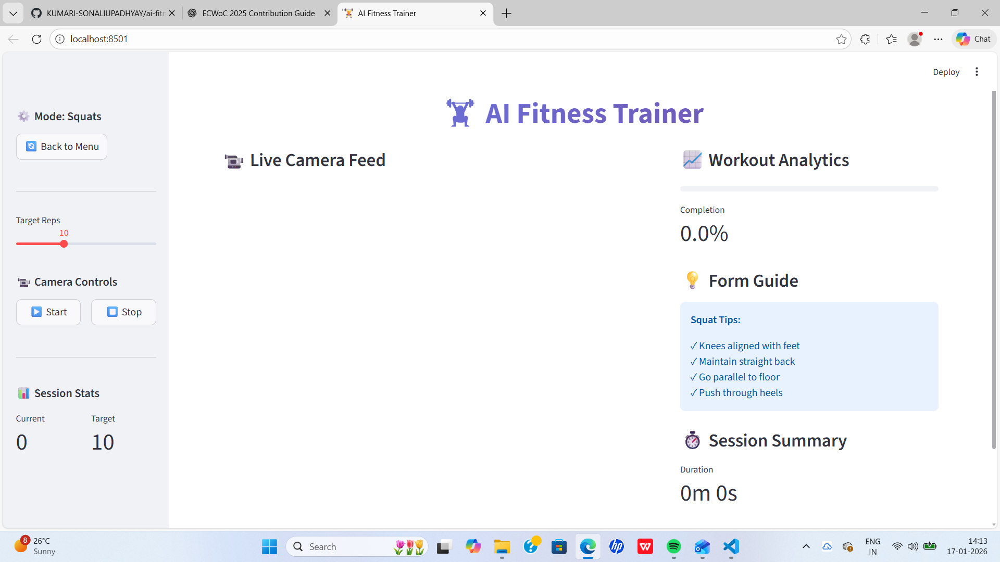
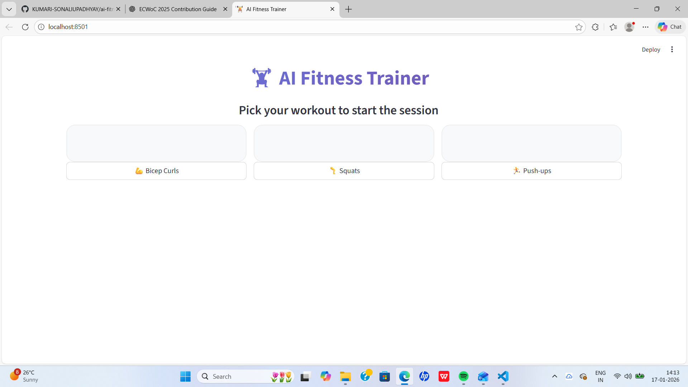

# AI Fitness Trainer with Real-Time Pose Estimation

[](https://opensource.org/licenses/MIT)
[](https://www.python.org/downloads/)
[](https://opencv.org/)
[](https://mediapipe.dev/)
[](https://streamlit.io/)
[](https://fastapi.tiangolo.com/)

An intelligent computer vision application that leverages **MediaPipe** and **OpenCV** to analyze human exercise form in real-time. This system provides live feedback, repetition counting, form correction, and workout session tracking, making fitness training more accessible and data-driven.

Designed with modularity and extensibility in mind, this project serves as a comprehensive resource for developers, students, and researchers interested in the intersection of AI, computer vision, and fitness technology.

## 🚀 Key Features

* **Real-time Pose Detection:** Utilizes MediaPipe to track 33 body landmarks with high precision.
* **Exercise Form Analysis:** Calculates joint angles to validate posture and movement quality.
* **Automatic Repetition Counting:** Logic-driven counting for dynamic exercises based on flexion/extension states.
* **Time-based Tracking:** Duration monitoring for static isometric exercises (e.g., Plank).
* **Calorie Estimation:** Metrics based on exercise intensity and duration.
* **Data Persistence:** Workout sessions are automatically serialized and stored in JSON format for historical analysis.
* **Dual Interfaces:** Includes both a lightweight Desktop OpenCV interface and a web-based Streamlit dashboard.
* **Resource Efficient:** Optimized for CPU performance; no dedicated GPU is required.
* **RESTful API:** FastAPI-based backend for integration with web/mobile apps.
* **Extensible Architecture:** Modular design for easy addition of new exercises and features.

### Supported Exercises

The system currently supports analysis for the following exercises, each with dedicated form validation logic:

* **Bicep Curls:** Analysis of elbow flexion and extension.
* **Squats:** Tracking of hip and knee flexion depth.
* **Push-ups:** Measurement of chest depth and body alignment.
* **Shoulder Press:** Analysis of vertical arm movement and symmetry.
* **Lunges:** Validation of lower body stability and knee angles.
* **Plank:** Monitoring of core stability and spinal alignment (Time-based).

## 🏗️ Architecture



### System Overview

1. **Pose Detection:** Captures the live video feed and maps 33 distinct landmarks on the human body.
2. **Movement Analysis:** Computes the geometric angles between specific joints to determine body state.
3. **Form Validation:** Compares calculated angles against biomechanical thresholds to provide feedback (e.g., "Keep your back straight").
4. **Progress Tracking:** Manages state machines for repetition counting and calculates caloric burn.
5. **Data Persistence:** Aggregates session statistics and saves them for long-term progress tracking.

## 🎯 Target Audience

* **Developers:** Those exploring real-time computer vision applications.
* **Students:** Individuals studying AI, kinematics, or software engineering.
* **Contributors:** Open-source enthusiasts looking for a modular codebase to extend.
* **Fitness Enthusiasts:** Users seeking objective analysis of their workout form.

## 📸 Screenshots

### Desktop Application


### Web Dashboard


## 🛠️ Quick Start

### Prerequisites

* **Python:** Version 3.8 or higher
* **Hardware:** Standard 720p webcam
* **OS:** Windows, Linux, or macOS

### Installation

1. **Clone the Repository**
```bash
git clone https://github.com/PathakAman66/ai-fitness-trainer.git
cd ai-fitness-trainer
```

2. **Install Dependencies**
```bash
# Recommended installation
pip install -r config/requirements.txt

# Manual installation
pip install mediapipe opencv-python numpy streamlit matplotlib fastapi uvicorn
```

3. **Verify Setup**
Run the simple test script to ensure the camera and libraries are functioning correctly.
```bash
python backend/tests/dependencies_test.py
```

## 📖 Usage Guide

### Option A: Desktop Application

This version runs locally using OpenCV windows and offers the best performance.

```bash
# Launch the desktop application (6 exercises + analytics)
python backend/core/app.py
```

### Option B: FastAPI REST API

Run the backend API server for web/mobile applications.

```bash
# Start the API server
python -m backend.api.main

# Or using uvicorn directly
uvicorn backend.api.main:app --reload --host 0.0.0.0 --port 8000
```

*Access the API documentation at: `http://localhost:8000/docs`*

### Option C: Web Interface (Streamlit)

A browser-based dashboard powered by Streamlit.

```bash
# Run Streamlit interface
streamlit run frontend/streamlit_interface.py
```

*Access the interface at: `http://localhost:8501`*

## 📋 API Reference

### Endpoints

- `GET /` - Health check
- `POST /analyze-pose` - Analyze pose from image data
- `GET /exercises` - List supported exercises
- `POST /start-session` - Start a workout session
- `POST /end-session` - End a workout session
- `GET /session/{session_id}` - Get session details

For detailed API documentation, visit `http://localhost:8000/docs` when the server is running.

## 🔧 Technical Details

### Exercise Detection Logic

| Exercise | Detection Method | Key Measurements |
| --- | --- | --- |
| **Bicep Curl** | Elbow Angle | Shoulder → Elbow → Wrist angle |
| **Squat** | Hip/Knee Flexion | Hip → Knee → Ankle angle |
| **Push-up** | Chest Depth | Shoulder → Elbow angle + Spine alignment |
| **Shoulder Press** | Vertical Motion | Wrist → Elbow → Shoulder trajectory |
| **Lunge** | Leg Coordination | Bilateral knee and hip angles |
| **Plank** | Body Alignment | Shoulder → Hip → Ankle linearity |

### Project Structure

```
ai-fitness-trainer/
│
├── backend/                   # Backend Components
│   ├── api/                   # FastAPI REST API
│   │   ├── main.py           # API endpoints and application
│   │   ├── models.py         # Pydantic data models
│   │   ├── pose_detector.py  # Pose detection service
│   │   ├── exercise_analyzer.py  # Exercise analysis service
│   │   ├── workout_session.py    # Session management
│   │   └── session_manager.py    # Session state manager
│   │
│   ├── core/                  # Standalone Desktop App
│   │   └── app.py            # Desktop application with CV2 GUI
│   │
│   ├── utils/                 # Shared utilities
│   │   └── image_processor.py # Image encoding/decoding
│   │
│   ├── data/                  # Data storage
│   │   └── reports/          # JSON workout reports
│   │
│   └── tests/                 # Test suite
│       └── test_*.py         # Unit and integration tests
│
├── frontend/                  # User Interfaces
│   ├── streamlit_interface.py # Streamlit web dashboard
│   ├── progress_dashboard.py  # Progress visualization
│   ├── web-interface/         # HTML/CSS landing pages
│   └── assets/                # Images and static resources
│
├── config/                    # Configuration
│   └── requirements.txt       # Python dependencies
│
└── docs/                      # Documentation
    ├── architecture.md        # Detailed architecture docs
    ├── CONTRIBUTING.md        # Contribution guidelines
    └── CODE_OF_CONDUCT.md     # Code of conduct
```

## 🧪 Testing

Run the test suite to ensure everything is working correctly:

```bash
# Run all tests
python -m pytest backend/tests/

# Run specific test
python backend/tests/test_pose_detector.py
```

## 🚀 Deployment

### Docker

Build and run with Docker:

```bash
# Build the image
docker build -t ai-fitness-trainer .

# Run the container
docker run -p 8000:8000 -p 8501:8501 ai-fitness-trainer
```

### Azure Deployment

The application can be deployed to Azure using Azure Container Apps for both backend and frontend services, with Azure Storage for data persistence.

## 🤝 Contributing

Contributions are welcome! Please see our [Contributing Guide](docs/CONTRIBUTING.md) for detailed guidelines.

We are specifically looking for:

* **New Exercise Modules:** Logic for additional exercises.
* **Algorithm Optimization:** Improving the accuracy of pose detection.
* **UI/UX Improvements:** Enhancements to the Streamlit dashboard.
* **Analytics:** Advanced data visualization for workout history.
* **Mobile App:** React Native or Flutter integration.

### Development Workflow

1. Fork the repository.
2. Create a feature branch (`git checkout -b feature/NewFeature`).
3. Commit changes and ensure tests pass.
4. Submit a Pull Request.

## 📄 License

This project is open-source and licensed under the **MIT License**. See the [LICENSE](LICENSE) file for details.

## 🙏 Acknowledgments

* [MediaPipe](https://mediapipe.dev/) for pose estimation
* [OpenCV](https://opencv.org/) for computer vision
* [Streamlit](https://streamlit.io/) for web interface
* [FastAPI](https://fastapi.tiangolo.com/) for API framework

## 📞 Support

If you have any questions or need help, please:

* Open an issue on GitHub
* Check the [documentation](docs/)
* Join our community discussions

---

*Made with ❤️ for the fitness and AI community*
